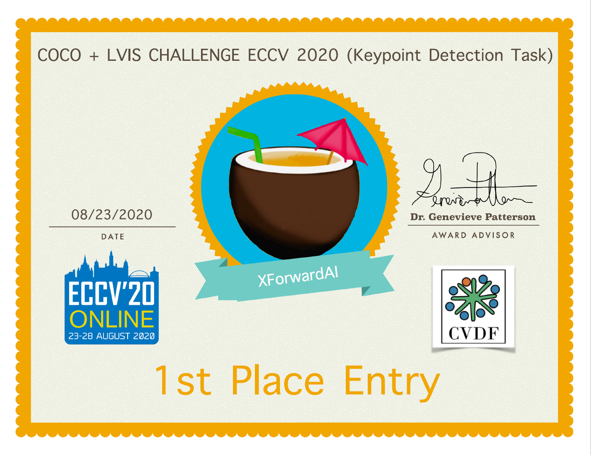

# UDP-Pose
 Official code of 《The Devil is in the Details: Delving into Unbiased Data Processing for Human Pose Estimation》
 Official code of 《AID: Pushing the Performance Boundary of Human Pose Estimation with Information Dropping Augmentation》
 
 
## News
* \[2021/1/12\] A new version of UDP paper is provided with more clear and more detailed methodology explaination, extra experimental results, and more discoveries. [ArXiv](https://arxiv.org/abs/1911.07524).
* \[2020/12/14\] AID for mmpose is provided in [HuangJunJie2017/mmpose](https://github.com/HuangJunJie2017/mmpose) alone with pretrained models in [BaiduDisk](https://pan.baidu.com/s/1mPuVj8piYzgWjoRgyd0Cwg)(dsa9). 
* \[2020/11/23\] UDP for mmpose is provided in [HuangJunJie2017/mmpose](https://github.com/HuangJunJie2017/mmpose) alone with pretrained models in [BaiduDisk](https://pan.baidu.com/s/1mPuVj8piYzgWjoRgyd0Cwg)(dsa9). Examples for both top-down paradigm and bottom-up paradigm are provided in this branch. 
* \[2020/11/04\] We propose UDPv1 with LOSS.KPD=3.5. The performance of UDPv1 is superior when compared with UDP in coco dataset. 
* \[2020/10/26\] We get a better tradeoff between speed and precision by applying UDP to the state-of-the-art Bottom-Up methods.
* \[2020/8/23\] We win the 2020 COCO Keypoint Detection Challenge with UDP!
* \[2020/6/12\] UDP for hrnet and UDP for RSN are provided.
* \[2020/2/24\] Paper has been accepted by CVPR2020!
* \[2019/11/10\] [Project page](https://github.com/HuangJunJie2017/UDP-Pose) is created.
* \[2019/11/7\] UDP is now on [ArXiv](https://arxiv.org/abs/1911.07524).

# Top-Down
### Results on MPII val dataset
|Method---|Head|Sho.|Elb.|Wri.|Hip|Kne.|Ank.|Mean|Mean 0.1|
|---------|----|----|----|----|----|----|----|----|----|
|HRNet32  |97.1|95.9|90.3|86.5|89.1|87.1|83.3|90.3|37.7|
|+Dark    |97.2|95.9|91.2|86.7|89.7|86.7|84.0|90.6|42.0|
|+UDP     |97.4|96.0|91.0|86.5|89.1|86.6|83.3|90.4|42.1|
### Results on COCO val2017 with detector having human AP of 65.1 on COCO val2017 dataset
| Arch            | Input size | #Params | GFLOPs |   AP | Ap .5 | AP .75 | AP (M) | AP (L) |    AR |
|-----------------|------------|---------|--------|------|-------|--------|--------|--------|-------|
| pose_resnet_50  |    256x192 | 34.0M   |   8.90 | 71.3 | 89.9  |  78.9  |  68.3  |  77.4  | 76.9  |
| **+UDP**        |    256x192 | 34.2M   |   8.96 | 72.9 | 90.0  |  80.2  |  69.7  |  79.3  | 78.2  |
| pose_resnet_50  |    384x288 | 34.0M   |   20.0 | 73.2 | 90.7  |  79.9  |  69.4  |  80.1  | 78.2  |
| **+UDP**        |    384x288 | 34.2M   |   20.1 | 74.0 | 90.3  |  80.0  |  70.2  |  81.0  | 79.0  |
| pose_resnet_152 |    256x192 | 68.6M   |   15.7 | 72.9 | 90.6  |  80.8  |  69.9  |  79.0  | 78.3  |
| **+UDP**        |    256x192 | 68.8M   |   15.8 | 74.3 | 90.9  |  81.6  |  71.2  |  80.6  | 79.6  |
| pose_resnet_152 |    384x288 | 68.6M   |   35.6 | 75.3 | 91.0  |  82.3  |  71.9  |  82.0  | 80.4  |
| **+UDP**        |    384x288 | 68.8M   |   35.7 | 76.2 | 90.8  |  83.0  |  72.8  |  82.9  | 81.2  |
| pose_hrnet_w32  |    256x192 | 28.5M   |   7.10 | 75.6 | 91.9  |  83.0  |  72.2  |  81.6  | 80.5  |
| **+UDP**        |    256x192 | 28.7M   |   7.16 | 76.8 | 91.9  |  83.7  |  73.1  |  83.3  | 81.6  |
| **+UDPv1**      |    256x192 | 28.7M   |   7.16 | 77.2 | 91.6  |  84.2  |  73.7  |  83.7  | 82.5  |
| **+UDPv1+AID**  |    256x192 | 28.7M   |   7.16 | 77.9 | 92.1  |  84.5  |  74.1  |  84.1  | 82.8  |
| **RSN18+UDP**   |    256x192 | -       |    2.5 | 74.7 | -     | -      |  -     | -      | -     |
| pose_hrnet_w32  |    384x288 | 28.5M   |   16.0 | 76.7 | 91.9  |  83.6  |  73.2  |  83.2  | 81.6  |
| **+UDP**        |    384x288 | 28.7M   |   16.1 | 77.8 | 91.7  |  84.5  |  74.2  |  84.3  | 82.4  |
| pose_hrnet_w48  |    256x192 | 63.6M   |   14.6 | 75.9 | 91.9  |  83.5  |  72.6  |  82.1  | 80.9  |
| **+UDP**        |    256x192 | 63.8M   |   14.7 | 77.2 | 91.8  |  83.7  |  73.8  |  83.7  | 82.0  |
| pose_hrnet_w48  |    384x288 | 63.6M   |   32.9 | 77.1 | 91.8  |  83.8  |  73.5  |  83.5  | 81.8  |
| **+UDP**        |    384x288 | 63.8M   |   33.0 | 77.8 | 92.0  |  84.3  |  74.2  |  84.5  | 82.5  |

### Note:
- Flip test is used.
- Person detector has person AP of 65.1 on COCO val2017 dataset.
- GFLOPs is for convolution and linear layers only.
- UDPv1: v0:LOSS.KPD=4.0, v1:LOSS.KPD=3.5

### Results on COCO test-dev with detector having human AP of 65.1 on COCO val2017 dataset
| Arch            | Input size | #Params | GFLOPs |   AP | Ap .5| AP .75| AP (M)| AP (L)|    AR|
|-----------------|------------|---------|--------|------|------|-------|-------|-------|------|
| pose_resnet_50  |    256x192 | 34.0M   |   8.90 | 70.2 | 90.9 |  78.3 |  67.1 |  75.9 | 75.8 |
| **+UDP**        |    256x192 | 34.2M   |   8.96 | 71.7 | 91.1 |  79.6 |  68.6 |  77.5 | 77.2 |
| pose_resnet_50  |    384x288 | 34.0M   |   20.0 | 71.3 | 91.0 |  78.5 |  67.3 |  77.9 | 76.6 |
| **+UDP**        |    384x288 | 34.2M   |   20.1 | 72.5 | 91.1 |  79.7 |  68.8 |  79.1 | 77.9 |
| pose_resnet_152 |    256x192 | 68.6M   |   15.7 | 71.9 | 91.4 |  80.1 |  68.9 |  77.4 | 77.5 |
| **+UDP**        |    256x192 | 68.8M   |   15.8 | 72.9 | 91.6 |  80.9 |  70.0 |  78.5 | 78.4 |
| pose_resnet_152 |    384x288 | 68.6M   |   35.6 | 73.8 | 91.7 |  81.2 |  70.3 |  80.0 | 79.1 |
| **+UDP**        |    384x288 | 68.8M   |   35.7 | 74.7 | 91.8 |  82.1 |  71.5 |  80.8 | 80.0 |
| pose_hrnet_w32  |    256x192 | 28.5M   |   7.10 | 73.5 | 92.2 |  82.0 |  70.4 |  79.0 | 79.0 |
| **+UDP**        |    256x192 | 28.7M   |   7.16 | 75.2 | 92.4 |  82.9 |  72.0 |  80.8 | 80.4 |
| pose_hrnet_w32  |    384x288 | 28.5M   |   16.0 | 74.9 | 92.5 |  82.8 |  71.3 |  80.9 | 80.1 |
| **+UDP**        |    384x288 | 28.7M   |   16.1 | 76.1 | 92.5 |  83.5 |  72.8 |  82.0 | 81.3 |
| pose_hrnet_w48  |    256x192 | 63.6M   |   14.6 | 74.3 | 92.4 |  82.6 |  71.2 |  79.6 | 79.7 |
| **+UDP**        |    256x192 | 63.8M   |   14.7 | 75.7 | 92.4 |  83.3 |  72.5 |  81.4 | 80.9 |
| pose_hrnet_w48  |    384x288 | 63.6M   |   32.9 | 75.5 | 92.5 |  83.3 |  71.9 |  81.5 | 80.5 |
| **+UDP**        |    384x288 | 63.8M   |   33.0 | 76.5 | 92.7 |  84.0 |  73.0 |  82.4 | 81.6 |
### Note:
- Flip test is used.
- Person detector has person AP of 65.1 on COCO val2017 dataset.
- GFLOPs is for convolution and linear layers only.

# Bottom-Up
### HRNet
| Arch            |P2I| Input size | Speed(task/s) |   AP | Ap .5| AP .75| AP (M)| AP (L)|    AR|
|-----------------|---|------------|---------------|------|------|-------|-------|-------|------|
| HRNet(ori)      |T  |    512x512 |  -            | 64.4 | -    |  -    |  57.1 |  75.6 | -    |
| HRNet(mmpose)   |F  |    512x512 |  39.5         | 65.8 | 86.3 |  71.8 |  59.2 |  76.0 | 70.7 |
| HRNet(mmpose)   |T  |    512x512 |  6.8          | 65.3 | 86.2 |  71.5 |  58.6 |  75.7 | 70.9 |
| HRNet+UDP       |T  |    512x512 |  5.8          | 65.9 | 86.2 |  71.8 |  59.4 |  76.0 | 71.4 |
| HRNet+UDP       |F  |    512x512 |  37.2         | 67.0 | 86.2 |  72.0 |  60.7 |  76.7 | 71.6 |
| HRNet+UDP+AID   |F  |    512x512 |  37.2         | 68.4 | 88.1 |  74.9 |  62.7 |  77.1 | 73.0 |
### HigherHRNet

| Arch            |P2I| Input size | Speed(task/s) |   AP | Ap .5| AP .75| AP (M)| AP (L)|    AR|
|-----------------|---|------------|---------------|------|------|-------|-------|-------|------|
| HigherHRNet(ori)|T  |    512x512 |  -            | 67.1 | -    |  -    |  61.5 |  76.1 | -    |
| HigherHRNet     |T  |    512x512 |  9.4          | 67.2 | 86.1 |  72.9 |  61.8 |  76.1 | 72.2 |
| HigherHRNet+UDP |T  |    512x512 |  9.0          | 67.6 | 86.1 |  73.7 |  62.2 |  76.2 | 72.4 |
| HigherHRNet     |F  |    512x512 |  24.1         | 67.1 | 86.1 |  73.6 |  61.7 |  75.9 | 72.0 |
| HigherHRNet+UDP |F  |    512x512 |  23.0         | 67.6 | 86.2 |  73.8 |  62.2 |  76.2 | 72.4 |
| HigherHRNet+UDP+AID |F  |    512x512 |  23.0         | 69.0 | 88.0 |  74.9 |  64.0 |  76.9 | 73.8 |
### Note:
- ori : Result from original [HigherHrnet](https://github.com/HRNet/HigherHRNet-Human-Pose-Estimation)  
- mmpose : Pretrained models from [mmpose](https://github.com/open-mmlab/mmpose) 
- P2I : PROJECT2IMAGE 
- we use [mmpose](https://github.com/open-mmlab/mmpose) for codebase
- the configurations of the baseline are HRNet-W32-512x512-batch16-lr0.001
- Speed is tested with dist_test in mmpose codebase and 8 Gpus + 16 batchsize
# Quick Start
(Recommend) For mmpose, please refer to [MMPose](https://github.com/HuangJunJie2017/mmpose)

For hrnet, please refer to [Hrnet](https://github.com/leoxiaobin/deep-high-resolution-net.pytorch)

For RSN, please refer to [RSN](https://github.com/caiyuanhao1998/RSN)

Data preparation
For coco, we provide the human detection result and pretrained model at [BaiduDisk](https://pan.baidu.com/s/1mPuVj8piYzgWjoRgyd0Cwg)(dsa9)

### Citation
If you use our code or models in your research, please cite with:
```
@InProceedings{Huang_2020_CVPR,
author = {Huang, Junjie and Zhu, Zheng and Guo, Feng and Huang, Guan},
title = {The Devil Is in the Details: Delving Into Unbiased Data Processing for Human Pose Estimation},
booktitle = {The IEEE/CVF Conference on Computer Vision and Pattern Recognition (CVPR)},
month = {June},
year = {2020}
}
@article{huang2020aid,
  title={AID: Pushing the Performance Boundary of Human Pose Estimation with Information Dropping Augmentation,
  author={Huang, Junjie and Zhu, Zheng and Huang, Guan and Du, Dalong},
  journal={arXiv preprint arXiv:2008.07139},
  year={2020}
}

```